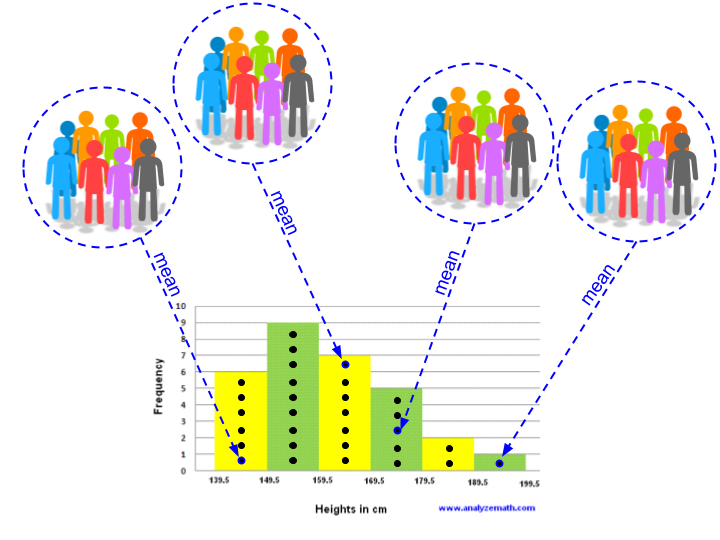
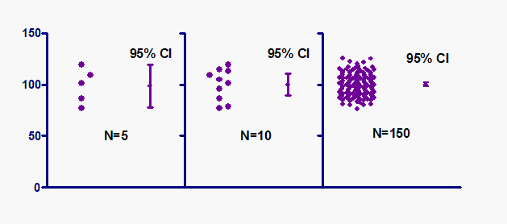

### <span style="color:green">This assignment is due at 11:59 p.m. (CDT) the day after your lab. \span

<span style="color:red">Please carefully read all of the instructions and explanations in this document. Put your answers to the questions in the answers file named "Ans3LastnameFirstname.Rmd". Remember to rename this file to contain your own last and first name! Before you submit your answers, click the **Knit** button in the toolbar above this editor window, and a new .html version of this document will be created. **You will need to submit both the .Rmd and the .html version of your completed answers file to canvas for grading.** In order to properly knit and create an html file, you will need agree to install any necessary packages, and fix any big code errors. **If you are at all confused, check with your TA to verify that you have valid output files before you leave lab - sometimes packages don't install properly or there's a glitch, and it's much easier to resolve this during lab time than over e-mail.** \span

## Part 1: Sampling Distributions

Many scientific questions are concerned with the mean of the population. For example, one question that could be asked is what is the average IQ of adults in Chicago. Finding the average IQ would be difficult as we would need to determine the IQ of every single adult in Chicago. One way to overcome this is to take a **random** sample of **n** adults in Chicago that is representative of the overall population, find their IQ and calculate the sample mean. The sample mean is an **unbiased estimator** of the population mean, which effectively means that for a large enough sample, our sample mean approximates the population mean well. 

In order to characterize errors in our sample mean (which is an estimate of our population mean), we need to go over how to come up with a sampling distribution. Let's say we wanted to find the sampling distribution of student heights. First, we would need to decide on a sample size and how many trials of sampling we would want to conduct.   Let's say we chose a sample size of 8, and we decided to conduct 30 trials. In order to find the sampling distribution, we would go out and measure the height of 8 random individuals, and would take the mean across that sample of 8 individuals and effectively turn those 8 measurements into 1 data point. We would then do 30 trials of this aka repeat the sampling and averaging process for a total of 30 times and to get 30 data points. If we were to plot the distribution of each of those 30 points on a histogram, we would get the sampling distribution of the population mean. The picture below illustrates this process. 




<span style="color:red"> **It is important to note that different random samples (with the same size) have different mean values. </span>**

Next, we're going to learn how to write a function in R that will sample multiple times from a data set and store each sample mean into a vector. Take a look at the code below which contains the function definition, as well as an example function call:

```{r comment = ''}
################################################
#function definition
################################################
funkySampler <- function(dataset, samplesize, nTrials){
    results <- numeric(nTrials)
    for(i in 1:nTrials){
        vectorSample <- sample(dataset, samplesize)
        results[i] <- mean(vectorSample)
    }
    return(results)
}

################################################
#function call
################################################
vectorOfInterest <- c(1:1000)
ourSampleSize <- 10
ournTrials <- 1000

#store the vector with the sample means into a var called `dist`
dist <- funkySampler(vectorOfInterest, ourSampleSize, ournTrials)

hist(dist, xlab="Protein Length", main="Distribution of Protein Samples")
mean(dist)
```

<span style="color:red"> **Please read the following section carefully and make sure that you understand </span>** 

Let's break this code down. The code first defines a new function called `funkySampler()` that will perform our desired calculations. In our function declaration, we say that `funkySampler()` is a function of three self-explanatory arguments: dataset, sampleSize, and nTrials. Within our function, the first thing that we do is to define our `results` vector. To see what the `numeric()` command does, try typing `numeric(10)` into the console. This just returns a vector with 10 zeroes, so in our case, `results` is a vector with a bunch of zeros that is the same length as the number of trials we will conduct. This step is very important: we will use this vector to store each sample mean, but before we can do that we need to first create a "blank vector" that we later index into and store values in.  The for loop iterates from `1` to `nTrials`, in this case this is 1 to 1000. In the next line of code, `sample(dataset, samplesize)` is a command that randomly picks `sampleSize` items from our `dataset`. Next, we take the mean of the values in our sample and store it in the ith position of the results vector. **Notice that as we progress through the for loop, all of the zeros in the results vector are being replaced by the mean of the sample we are taking. The blank vector is being filled in.** After the results vector has been fully populated (after the for loop has finished executing), we return the now-complete results vector.

The code then defines that variables that we will call the function on. In this specific example, the vector of interest that we will be sampling over is just a vector containing the integers between 1 and 1000 (in future questions, we will set our vector of interest to be `proteinDataVec` from Lab 2). We set the sample size (`ourSampleSize`) to be 10, and the number of trials (`ournTrials`) is 1000; this means that we will be doing 1000 trials where we sample 10 values at a time. 

We call the function using the parameters we defined above, and store it in a variable called `dist`. Finally, we plot a histogram of the sample means and calculate the average across all of the sample means.  

We will be using the protein data from lab 2 and the function given above (remember to give the function appropriate arguments) to perform the following tasks and answer the following questions.

#### Part 1 Questions

<span style="color:green">
**1.1** Load `protein_data.csv` file into R. Store the length column of the data to a new variable name `protein_DataVec`. Using R's built-in functions find the mean, range, and standard deviation of `protein_DataVec`. *Hint: use read.csv(), mean(), range(), sd()*. </span>

<span style="color:green">
**1.2** Use the funkySampler function above to simulate sampling `protein_DataVec`. Run simulations with sample sizes of 5, 15, 150, and 1500. Keep the number of trials at 85. For each simulation, plot the results in a histogram and find the mean of the results vector, as demonstrated above. Show the 4 means and 4 histograms that you get below and include appropriate axis labels and titles. *Hint: Assign each output of the function to a different variable (like `dist` in the example above) and find the mean and graph them all separately with 4 function calls to mean() and 4 function calls to hist()*.</span>

<span style="color:green">
**1.3** Considering each simulation in question 1.2, describe how the distribution of the results changes as the sample size changes.
</span>

<span style="color:green">
**1.4** For each simulation from question 1.2, how do the means of your samples compare to the population mean of `proteinDataVec`, found in question 1.1?
</span>

<span style="color:green">
**1.5** Repeat the tasks in question 1.2, but this time vary the number of trials (from 5 to 1500) while keeping the sample size constant at 7. What happens to the mean of our samples compared to the mean of our entire population as the number of trials increases?
</span>

<span style="color:red">
**Now if you think about what we've actually done in questions 1.2 and 1.5 - we've simulated the sampling distribution of the mean! Specifically, the output of funkySampler is this simulated distribution.**</span>

We're going to take another look at the dengue DNA sequence that we started analyzing for Lab 1. After setting your working directory to the folder where you have saved the dengue sequence file, run the following commands in R:

```{r}
library('seqinr')
dengue <- read.fasta(file = 'dengue_seq.txt')
dengue_vec <- as.vector(dengue[[1]])
```

<span style = "color:green">
**1.6 (a)** Recall the `GC_content` function from Lab 2 and the sampling function `funkySampler()` in this lab. Using and modifying the code used to create that function, create a new function called `findGC()` that will use your function from part (a) to find the GC content of a sample (i.e. instead of finding the mean of the sample, we now want to find its GC content). Have the function return the vector of these sample GC contents. *Note that you can directly call the `GC_content()` function within your code.* </span>

<span style = "color:green">
**1.6 (b)** Use your code from part (a) and perform four different simulations where you sample from `dengue_vec` using a sample size of 10, 100, 1000, and 10000. Keep the number of trials at 90 for each simulation. For each simulation, plot a histogram of the results vector and calculate the mean of the results vector. Describe how the distribution of the results changes as the sample size changes.</span>

<span style = "color:green">
**1.6 (c)** For each simulation, how do the means of your samples compare to the GC-content for the dengue DNA sequence as a whole?</span>


## Part 2: Standard Error

Because sample mean is an unbiased estimator of the population mean, the mean of the sampling distribution will be equal to the population mean. We can also define an uncertainty in our estimate of the population mean. <span style="color:red">The **standard error** is the standard deviation of the sampling distribution for a given sample</span>. However, we often are unable to generate enough samples (i.e. **the number of trials** is not large enough) so we cannot accurately calculate standard error by taking the standard deviation of the sampling distribution as there are too few points in the sampling distribution.

Luckily, we can also calculate the standard error of the mean using the standard deviation of a single sample ${\sigma_x}$ and n, the sample size (i.e. the number of subjects in a sample) as: $$SE ≈ \frac{\sigma_x}{\sqrt{n}}$$ 

**In short, the standard error of the mean is an estimate of the precision of the measured sample mean.**

Now if you think about what we've actually done in questions 1.2 and 1.5 - we've simulated the sampling distribution of the mean! Specifically, the output of funkySampler is this simulated distribution. So we can compute the standard error of the sample means by computing the standard deviation of this distribution.

#### Part 2 Questions

<span style="color:green">
**2.1** Compute the standard deviation of each sampling distribution you simulated in questions 1.2 and 1.5 to get the standard error of the mean. Based on these results, which is more important for **precision**: the number of trials or the sample size? Explain.
</span>

<span style="color:green">
**2.2** Write a function called `SE()` that takes in a dataset (a numeric vector) and returns the standard error of the mean. You may use the built-in function `sd()`.</span>

<span style="color:green">
**2.3** Recall that we can also compute standard error of the mean from a single sample. Draw multiple samples from `protein_DataVec`, varying the sample size from 5 to 1500 as before and compute standard error with your written standard error function. How do your results compare to the standard errors calculated in question 2.1? </span>


## Part 3: Confidence Intervals

Confidence intervals help us gauge the reliability of an estimate. A 95% confidence interval for the mean is defined as the range of values around your sample mean that you can be 95% certain contains the true mean of the population. Look at the picture below to get a sense of what this means. Each graph shows three samples of different size that were all sampled from the same population. This image comes from https://www.graphpad.com/guides/prism/7/statistics/stat_more_about_confidence_interval.htm.



In the example above, the confidence level of the confidence interval is 95%. This is the most common choice of confidence level, but confidence levels of 90% or 99% are also fairly common. Confidence levels correspond to percentages of the area of a normal density curve- this means that a 95% confidence interval covers 95% of a normal curve or is within 2 standard deviations of the mean. See the diagram below from http://www.stat.yale.edu/Courses/1997-98/101/confint.htm for clarification.


A confidence interval for the mean is mathmatically defined as $\overline{x} \pm z * \frac{\sigma}{\sqrt{n}}$ or the mean plus or minus a z-value (from the standard normal distribution for your desired confidence interval) times the standard error. In order to find the z-value, using R, we will use a function called `qnorm()` that takes in a percent (in decimal form) and returns this value. We'll talk more about the command `qnorm()` in a later lab, but for now what you need to now is that `qnorm(0.975)` gives the x-value for which the area under the standard normal distribution is 97.5% of the total area under the curve (which is 1). The code chunk and picture below show how this function works. 

```{r comment = ''}
qnorm(0.975)
```


Given all the things explained above, this is how we would calculate the 95% confidence interval under the assumption that the sampling distribution is normally distributed:

```{r comment = ''}
sampleMean <- 10
SD <- 3
n <- 30
error <- qnorm(0.975) * SD / sqrt(n) 
lower <- round(sampleMean - error, digits = 2) #lower value of the 95% confidence interval, rounded to contain 2 decimal places
upper <- round(sampleMean + error, digits = 2) # upper value of the 95% confidence interval, rounded to contain 2 decimal places
CI95 <- paste(toString(lower), ",", toString(upper)) # turn the two numbers into a string
CI95
```

#### Part 3 Questions

<span style="color:green">
**3.1 (a)** Why did we use `qnorm(0.975)` instead of `qnorm(0.95)` to find the 95% confidence interval? </span>

<span style="color:green">
**3.1 (b)** How would we find the 95% confidence interval with the x-value obtained through `qnorm(0.975)`? </span>

<span style="color:green">
**3.1 (c)** Explain how to calculate the 90% confidence interval using the `qnorm` function.
<span>

<span style="color:green">
**3.2** Write a function named `CI95` that takes in a vector of numeric values and returns the the 95% confidence interval. *Note: you should use built-in functions such as `mean()` and `sd()`.
</span>

A coefficient of variance (CV) is defined as the ratio of the standard deviation (SD) to the mean or $\frac{\sigma}{\overline{x}}* 100$.

<span style="color:green">
**3.3 (a)** Create two variables `vec1` and `vec2`. The first contains 8500 random numbers whose values range from 0-1 from a uniform distribution. The second contains 8500 numbers from a normal distribution with mean 15. </span>

<span style="color:green">
**3.3 (b)** Use the the function `hist()` to visualize the spread of the two vectors.
</span>

<span style="color:green">
**3.3 (c)** Find the CV for both vectors and compare the results (what does the difference in your calculated values tell you, and why does it make sense).
</span>


## Part 4: Aggregate Command and Data Frames

As a reminder from Lab2, a data frame (table) is very similar to a matrix. **The biggest difference between a matrix and a data frame is that matriceshave to be of the same type while data frames can contain mixed types of data**. The PlantGrowth is a built-in data frame in R that contain the results from an experiment to compare yields (as measured by dried weight of plants) obtained under a control and two different treatment conditions.
<br>
We can execute functions over data assigned to factors by using the `aggregate()` function. This is particularly useful when we want to obtain summary data such as the mean and standard deviation. For example,

```{r comment = ''}
PlantGrowth
aggregate(PlantGrowth$weight, by=list(PlantGrowth$group), FUN=mean)
```

The `aggregate` command divided our data table into the control, treatment 1, and treatment 2 groups and found the mean plant weight separately for each group. The `FUN` parameter is used to specify which R function should be executed. For example, if we want to calculate the variance (`var()`)  rather than the mean we can simply execute: 

```{r comment = ''}
aggregate(PlantGrowth$weight, by=list(PlantGrowth$group), FUN=var)
```

#### Part 4 Questions

<span style="color:green">
**4.1** Use the `aggregate` function to calculate the standard deviation for each of the groups in `PlantGrowth`.
</span>

<span style="color:green">
**4.2** Using your `CI95` function that you made in the section on confidence intervals, calculate the 95% confidence intervals for each of the groups in `PlantGrowth`
</span>

`ToothGrowth` is another built-in data frame in R that tells us about the effect of vitamin C on tooth growth in guinea pigs. The first column, `len` contains information about the length of the tooth. The second column, `supp`, tells you the type of supplement that was given to each guinea pig (vitamin C or orange juice), and the third column, `dose`, tells you the dose of the supplement. 

<span style="color:green">
**4.3 (a)** Write a command to find the standard deviation of tooth length for the group given vitamin C supplements and for the group given orange juice. </span>

<span style="color:green">
**4.3 (b)** Make a boxplot for the ToothGrowth length as a function of the supplement. Explain the trends you observe. </span>


## Part 5: Bernoulli Trials

A Bernoulli Trial (or binomial trial) is a simulation that has two possible outcomes. The outcomes can be considered as a "success" or a "failure". It is called a Bernoulli trial because it was first formalized by Jacob Bernoulli.

#### Part 5 Questions

As you will learn in lecture, one easy way to make a null hypothesis distribution is to flip many coins and count the number of outcomes (heads or tails).

<span style="color:green">
**5.1** Execute the following code. What does the `round()` function do?
</span>
```{r comment = ''}
vector <- c(0.10, 0.30, 0.67, 0.59, 0.49, 0.50, 0.77)
round(vector)
```

<span style="color:green">
**5.2** Define a variable called `flips` (the number of coin flips we want to simulate). For now, set `flips` to be 100. To simulate 100 coin flips, use the functions `runif()` and `round()` to return a vector called results consisting of 1's and 0's (**let's say the 1's correspond to the number of heads and the 0's correspond to the number of tails**).</span>

<span style="color:green">
**5.3** What does `sum(results)` tell us about our coin flips?</span>

<span style="color:green">
**5.4** Define an additional variable `trials` (the number of trials we will have of our coin flips). Using what we learned in parts 5.2 and 5.3, write a fuction that takes in two arguments: `flips` and `trials.` Using the code you wrote in 5.2, `flips` should designate how many times a coin is flipped during a single trial. `trials` should designate how many times this is repeated. Then, use your reasoning from 5.3 to find the proportion of successfully flipping a head. Save the proportion you get in each trial in the `results` vector. You will need a for loop (remember to define an empty `results` vector before the for loop).</span>

<span style="color:green">
**5.5** Using your above function, flip 90 coins for 10, 500, and 10000 trials. Plot a histogram of your results **with correct labels** for each simulation. How does the distribution change by increasing the number of trials? Explain your answer. Make sure to run your code a couple times to get a good picture of how it behaves. </span>

<span style="color:green">
**5.6** Repeat part 5.5 with 5, 90, and 1000 coins with a fixed number of trials of 300. How does the distribution change when you increase the number of coin flips for each trial? Explain your answer. Pay close attention to the scales on the x and y axes when formulating your answer.</span>


